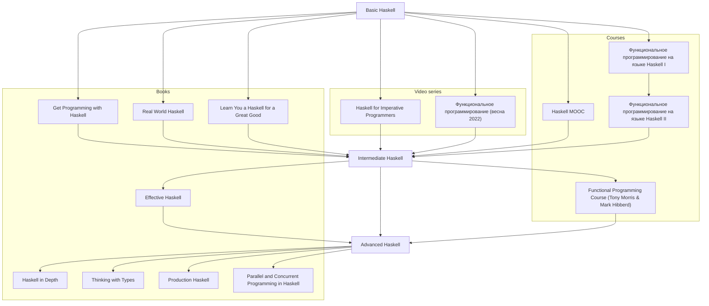

#  Haskell bo'yicha manbaalar ma'lumotnomasi

## Kitoblar

### Inliz tilida

#### Boshlang'ich

- [Get Programming with Haskell][b-get-programming-with-haskell]
- [Real World Haskell][b-real-world-haskell]
- [Learn You a Haskell for a Great Good][b-learn-you-haskell]

#### O'rta

- [Effective Haskell][b-effective-haskell]

#### Oliy

- [Haskell in Depth][b-haskell-in-depth]
- [Thinking with Types][b-thinking-with-types]
- [Production Haskell][b-production-haskell]
- [Parallel and Concurrent Programming in Haskell][b-parallel-and-concurrent-programming-in-haskell]

### Roadmap

## Kurslar

### Ingliz tilida

- [Haskell MOOC][c-haskell-mooc]

### Rus tilida

- [Функциональное программирование на языке Haskell I][c-stepik-1]
- [Функциональное программирование на языке Haskell II][c-stepik-2]

## Amaliy yondashuvga asoslangan kurslar

### Ingliz tilida

- [Functional Programming Course (Tony Morris & Mark Hibberd)][pc-fp-course]

## Video seriyalar

### Ingliz tilida

- [Haskell for Imperative Programmers][v-haskell-for-imperative-programmers] - Philipp Hagenlocher
  
- [Introduction to Haskell][https://www.youtube.com/playlist?list=PLD8gywOEY4HauPWPfH0pJPIYUWqi0Gg10] - Andres Löh

- [The Haskell Unfolder][https://www.youtube.com/playlist?list=PLD8gywOEY4HaG5VSrKVnHxCptlJv2GAn7] - Andres Löh and Edsko de Vries.

### Rus tilida

- [Функциональное программирование (весна 2022)][v-csc-fp] - Computer Science Center

## Konferensiyalar

### Lambda Conference

- [Haskell Type Classes][conf-lc-2024-june-haskell-type-classes] - Haskelldagi tip klasslar va ularning ierarxiyasi haqida.

## Paketlar

- [Hackage][p-hackage] - Paketlar indeksi
- [Hoogle][p-hoogle] - Paket qidiruv tizimi

### Boshqa ma'lumotnomalar

- [Formal Verifikatsiya bo'yicha manbaalar ma'lumotnomasi](./FORMAL_VERIFICATION.md)

[b-get-programming-with-haskell]: https://www.manning.com/books/get-programming-with-haskell
[b-real-world-haskell]: https://book.realworldhaskell.org/read
[b-learn-you-haskell]: http://learnyouahaskell.com/chapters
[b-effective-haskell]: https://pragprog.com/titles/rshaskell/effective-haskell
[b-haskell-in-depth]: https://www.manning.com/books/haskell-in-depth
[b-thinking-with-types]: https://thinkingwithtypes.com/
[b-production-haskell]: https://leanpub.com/production-haskell
[b-parallel-and-concurrent-programming-in-haskell]: https://simonmar.github.io/pages/pcph.html

[c-haskell-mooc]: https://haskell.mooc.fi
[c-stepik-1]: https://stepik.org/course/75
[c-stepik-2]: https://stepik.org/course/693

[v-haskell-for-imperative-programmers]: https://www.youtube.com/playlist?list=PLe7Ei6viL6jGp1Rfu0dil1JH1SHk9bgDV
[v-csc-fp]: https://www.youtube.com/playlist?list=PLlb7e2G7aSpTDub2LFDVBvvjWj-53Gfuh

[conf-lc-2024-june-haskell-type-classes]: ./conferences/Lambda%20Conference/2024/June/Haskell%20Type%20Classes/README.md

[p-hackage]: https://hackage.haskell.org
[p-hoogle]: https://hoogle.haskell.org

[pc-fp-course]: https://github.com/system-f/fp-course
