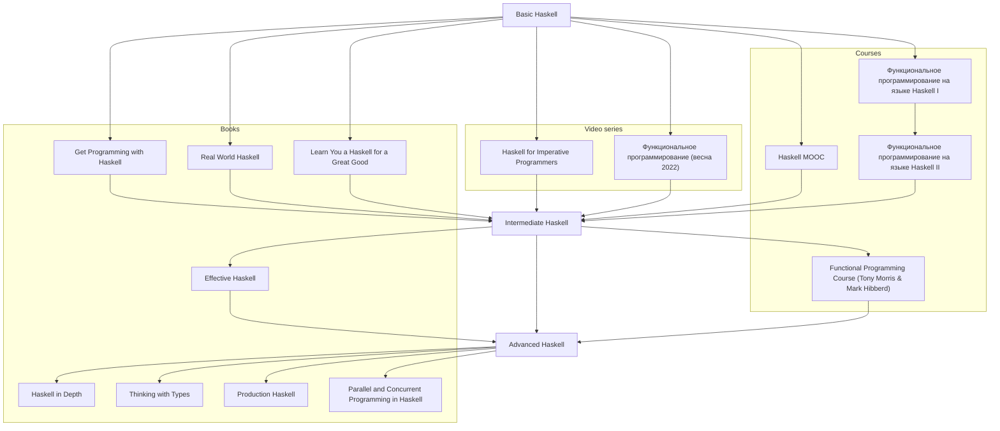

# Roadmap

```mermaid
graph TD
    A1[Basic Haskell]
    A2[Intermediate Haskell]
    A3[Advanced Haskell]

    A1 --> B1_1[Get Programming with Haskell]
    A1 --> B1_2[Real World Haskell]
    A1 --> B1_3[Learn You a Haskell for a Great Good]
    A1 --> C1_1[Haskell MOOC]
    A1 --> C1_2[Функциональное программирование на языке Haskell I]
    A1 --> V1_1[Haskell for Imperative Programmers]
    A1 --> V1_2["Функциональное программирование (весна 2022)"]

    C1_2 --> C1_3[Функциональное программирование на языке Haskell II]

    A2 --> B2_1[Effective Haskell]
    A2 --> C2_1["Functional Programming Course (Tony Morris & Mark Hibberd)"]

    A3 --> B3_1[Haskell in Depth]
    A3 --> B3_2[Thinking with Types]
    A3 --> B3_3[Production Haskell]
    A3 --> B3_4[Parallel and Concurrent Programming in Haskell]

    B1_1 & B1_2 & B1_3 & C1_1 & C1_3 & V1_1 & V1_2 --> A2
    B2_1 & A2 & C2_1 --> A3

    subgraph "Books"
    B1_1
    B1_2
    B1_3
    B2_1
    B3_1
    B3_2
    B3_3
    B3_4
    end

    subgraph "Courses"
    C1_1
    C1_2
    C1_3
    C2_1
    end

    subgraph "Video series"
    V1_1
    V1_2
    end
```
